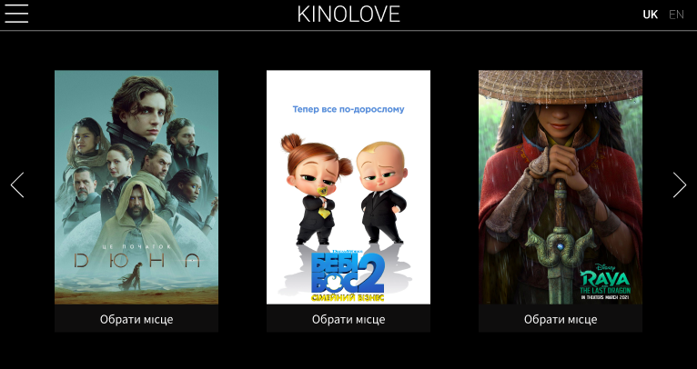
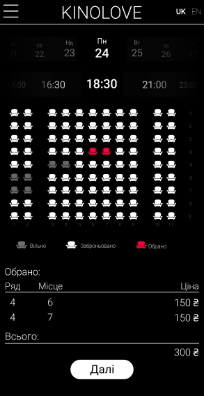

# Kinolove. Технічне завдання
### 1.Загальні відомості
- Назва компанії: Kinolove
- Дата створення: 01.01.2010
- Рід діяльності: мережа кінотеатрів
- Товари та послуги: показ кінофільмів
 - Унікальні пропозиції: можливість бронювання окремих залів і замовлення фільмів
### 2.Призначення сайту 
 - Тип: Сервіс для перегляду фільмів, що доступні в прокаті та бронювання квитків
 - Портрет цільової аудиторії: 
    Користувачі віком 14-60 років, які хочуть швидко і зручно забронювати квиток, а також переглянути трейлер/оцінку/відгуки до фільму 
### 3.Структура та навігація
- Ієрархія сторінок та розділів 
    
    Коли користувач відкриває сайт, він потрапляє на головну сторінку, де представлені фільми, що знаходяться зараз у прокаті. Коли гість натискає на постер, він потрапляє на сторінку з інформацією про фільм (каст, трейлер, опис фільму). Якщо користувачу фільм сподобобався, він може перейти на сторінку, де він може вибрати годину сеансу, дату а також місця в залі, які є вільними.
    
    Також на сайті присутні сторінки з загальною інформацією про компанію а також правилами, на які погоджується відвідувач автоматично, купуючи квиток 
- Способи навігації по сайту
    
    Навігація по загальним сторінкам здійснюється через випадаюче меню зліва. Перехід від фільму до фільму, а також до бронювання квитків, здійснюється натисканням відповідних кнопок
### 4.Прототипи і сценарії використання
- Макети сторінок 

    

    

    

     

    Більш детально можете оглянути макет десктопної версії [тут](https://www.figma.com/file/0F3IVt3feRI558GjwxpOmZ/1?node-id=0%3A1), і мобільної версії [тут](https://www.figma.com/file/YEUp8y0aHIcC2diDhfGAY7/2?node-id=0%3A1)

    - Сценарії взаємодії з користувачем

    Взаємодія з користувачем відбувається в компоненті сайту, де він хоче забронювати квиток. Користувач відкриває сторінку, і одночасно робиться запит на сервер, який у відповідь надає інформацію про вільні місця/час сеансів. Користувач вибирає місце і бронює квиток, робить запит на сервер, який фіксує, що дані місця вже зайняті

    ### 5.Вимоги до SEO
  | Таблицы       | Это                |
  | ------------- |:------------------:|
  | Лічильники **Google Analytics** | Дані про сесіях наших користувачів - ключ до успіху.Для установки тегів іспользуйтся Google Tag Manager. З нею можна додавати і видаляти теги, робити настроювання цілей та інше. |
  | Заголовки | На всіх сторінках сайтах рекомендується наявність заголовка `<h1>`. Також бажано використання заголовків інших рівнів: `<h2>`, `<h3>` і т.д, особливо на текстових сторінках. Заголовки допомагають пошуковим роботам зрозуміти контент сторінки і визначити його релевантність запиту, а користувачам швидко знайти необхідну інформацію. |
  | Тексти | Тексти повінні бути: добре структуровані, з корисною інформацією та контекстними посиланнями. |
  | Швидкість завантаження сторінок  | Люди не люблять чекати. Не створюйться занадто громіздкі сторінки. |
  | 404 помилка | Виключити індексацію сторінок з помилкою можна, якщо при введенні некоректного URL сервер буде віддавати 404 Not Found. Також на сторінці можна вказати посилання на найбільш важливі сторінки сайту, наприклад, розділи каталогу. |  
  | ЗЛУ  | Зрозумілий людині "урл", тобто URL, який легко можна прочитати. ЗЛУ має на увазі використання URL, що дають чітке уявлення про поточний стан користувача і вмісті сторінки. |
  | Robots.txt | Файл robots.txt створюється в кореневій директорії сайту. Він призначений для роботів пошукових систем. Тут можна дозволити або заборонити індексацію певних сторінок / груп сторінок, вказати основний домен, шлях до карти сайту і інше. |

 ### 6.Технічні характеристики
- Рекомендації по вибору CMS і хостингу

    Сервіс буде розміщений на хостингу Heroku, оскільки кількість користувачів, що очікується, дозволяє використати відносно дешевий хостинг з невеликим навантаженням на сервера
- Особливості створення сторінок

    Сервіс буде відповідати всім останнім вимогам UI та UX розробки.
- Технічна оптимізація сайту

    Клієнтська частина буде розроблятись на основі бібліотеки React, а серверна частина буде написана на Node.js. Такий вибір обумовлений наступними чинниками:
     - Команда розробників гарно ознайомлена з даним стеком технологій, тому розробка триватиме менше по часу, ніж звичайно
     - Інструменти є актуальними, і не будуть потребувати в реорганізації ще довгий час
     - Серверна частина буде написана саме на Node.js, оскільки по швидкодії чистий node.js випереджує фреймворк Express майже в 4 рази
- Тестові роботи та контроль помилок на сайті

    Всі компоненти сервісу будуть покриті тестами, що мінімізує кількість виникнених багів. Для тестування буде використовуватися фрейморк Jest
